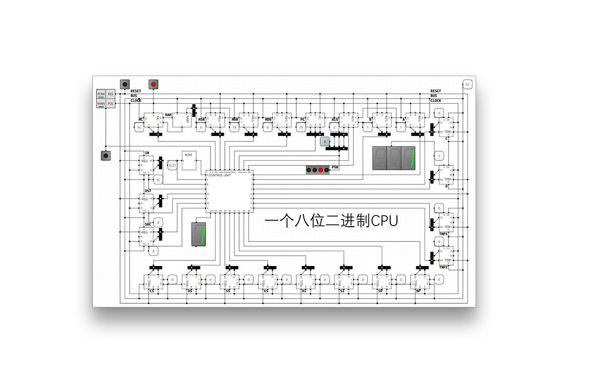

# computer - 计算机体系结构

[本项目地址](https://github.com/StevenBaby/computer)

## 一个8位二进制CPU的设计和实现

- [相关 bilibili 视频](https://www.bilibili.com/video/BV1aP4y1s7Vf)

- [LogicCircuit](http://www.logiccircuit.org/)

## x86 汇编语言

> 不同视频的代码请查看 git commit 历史。

- [相关 bilibili 视频](https://www.bilibili.com/video/BV1b44y1k7mT)

- [Ubuntu 配置 bochs 的方法](./x86_assembly/docs/Ubuntu%20配置%20bochs%20的方法.md) 感谢 [@烟花笑寂寞](https://github.com/1126zk)

- [参考资料](./x86_assembly/docs/参考资料.md)

## 操作系统实现

- <https://github.com/StevenBaby/onix>

- [相关 bilibili 视频](https://www.bilibili.com/medialist/play/491131440?from=space&business=space_collection&business_id=146887)

## Linux 源码分析

- <https://github.com/StevenBaby/alinux>

Working on it, coming soon.....
