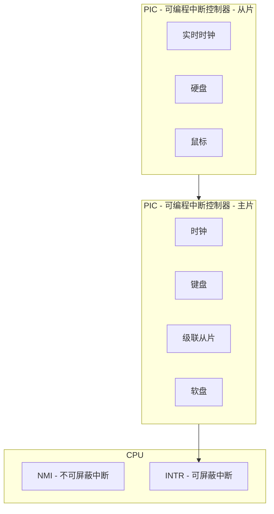

```mermaid
flowchart TD
    subgraph CPU
        NMI[NMI - 不可屏蔽中断]
        INTR[INTR - 可屏蔽中断]
    end
    subgraph PICM[PIC - 可编程中断控制器 - 主片]
        CLC[时钟]
        KB[键盘]
        SLAVE[级联从片]
        FLOPPY[软盘]
    end
    subgraph PICS[PIC - 可编程中断控制器 - 从片]
        RTC[实时时钟]
        HD[硬盘]
        MOUSE[鼠标]
    end
    PICM --> INTR
    PICS --> PICM
```

```mermaid
flowchart LR
取指 --> 译码 --> 执行 --> 中断
```