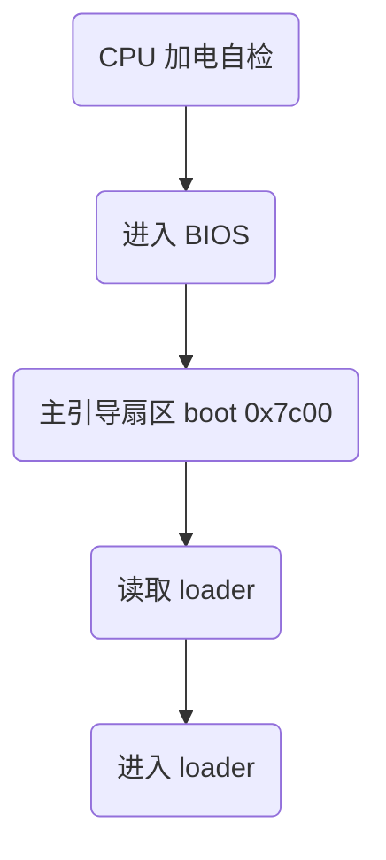

# PC 启动流程

```mermaid
flowchart TD
T1(CPU 加电自检)
T1 --> T2(进入 BIOS)
T2 --> T3(主引导扇区 boot 0x7c00)
T3 --> T4(读取 loader)
T4 --> T5(进入 loader)
```

主引导扇区(MBR Main Boot Record)只有 512 个字节：

- 446 可用
- 64 硬盘分区表
- 2 0x55aa
